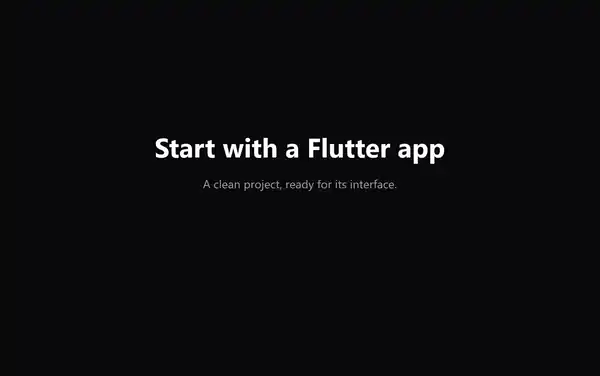

<p align="center">
  
</p>

# Elattar Design System

Production-ready Flutter components delivered as source you own. Start with a
native foundation, copy only the components you need, and keep every design
decision visible in your codebase.

[](https://github.com/ELATTAR-Ayoub/flutter-design-system/actions/workflows/ci.yml)
[](https://pub.dev/packages/elattar_cli)
[](LICENSE)

`0.0.2`, the current public release.

[Documentation](https://flutter.elattar.dev) ·
[Components](https://flutter.elattar.dev/components) ·
[Installation](https://flutter.elattar.dev/docs/installation) ·
[Skills](https://flutter.elattar.dev/skills) ·
[Changelog](CHANGELOG.md) ·
[0.1.0 milestone](docs/launch/0.1.0-release-contract.md) ·
[Adoption](docs/ADOPTION.md)

## Own your first component

Run three commands inside a Flutter project:

```bash
dart install elattar_cli
cd my_flutter_app
elattar init --foundation source
elattar add button
```

<p align="center">
  
</p>

That is the whole quickstart. `elattar add button` copies the component and its
foundation dependencies into your project. The installed source is yours to
inspect, change, and ship—there is no design-system runtime dependency hiding
the implementation.

The current registry contains 99 integrity-checked items, including accessible
controls, navigation, data display, charts, agent UI, effects, motion, and one
complete application block. Browse the [live component
gallery](https://flutter.elattar.dev/components) or watch the [45-second
quickstart](docs/assets/launch/elattar-quickstart.mp4) before installing
anything.

Use `elattar add --all` for the complete registry and `elattar doctor` to check
the installation. Windows PATH help, offline use, and every CLI option live in
the [CLI README](packages/elattar_cli/README.md).

## Source you own

<p align="center">
  
</p>

Elattar distributes Flutter source instead of hiding components behind a
package boundary.

- Files are copied into your project and recorded in `.elattar/manifest.json`.
- Imports are rewritten to your generated local barrels.
- Every registry payload is verified before the first file is written.
- Released registry paths are immutable.
- `--dry-run`, `--offline`, local registries, and mirrors are supported.

The root `elattar_design_system` package remains the authoritative
implementation, but it is intentionally not published to pub.dev. The public
distribution route is `elattar_cli` and the source registry.

## What is included

<p align="center">
  
</p>

The `0.0.2` registry contains 99 items: 97 components, one application block,
and one foundation bundle.

- **Foundation:** semantic color, responsive typography, spacing, radii,
  shadows, surfaces, media queries, motion, reduced motion, and path-drawn
  icons.
- **Components:** forms, selection, menus, navigation, dialogs, overlays,
  feedback, data display, charts, chat, layout, sidebar, and agent UI.
- **Effects and motion:** press and hover feedback, active indicators,
  keyframes, glass, premium surfaces, ambient patterns, and the voice orb.
- **Fonts:** Inter for words and Geist Mono for code, identifiers, and numbers.

The public API uses ordinary Flutter names with no prefix: `Button`, `Card`,
`Icon`, `TextStyles`, and `space(...)`.

## Use a component

Projects initialized by the CLI receive two local barrels:

```dart
import 'components/ui/ui.dart';
import 'design_system/foundation.dart';

Button(
  onPressed: () {},
  child: const StyledText('Continue', TextStyles.nav),
)
```

The foundation owns visual values. Components consume its color, type,
spacing, radius, shadow, and motion tokens rather than creating a second visual
system.

## CLI

| Command | Purpose |
| --- | --- |
| `elattar init --foundation source` | Install the foundation, fonts, config, and notices |
| `elattar add <items...>` | Install components and their dependencies |
| `elattar add --all` | Install the complete registry |
| `elattar list` | List available items |
| `elattar search <query>` | Search the registry |
| `elattar info <name>` | Inspect one item |
| `elattar doctor` | Check the project, manifest, dependencies, and registry |

The published CLI is `elattar_cli 0.0.2`. It reads the immutable
[`0.0.2` registry](https://flutter.elattar.dev/registry/0.0.2/) by default.

## Agent skill

<p align="center">
  
</p>

`elattar-flutter-ui-director` teaches Claude Code to inspect the installed API,
compose existing components, use foundation tokens, cover relevant states, and
verify Flutter UI in proportion to the task.

Run these commands inside Claude Code:

```text
/plugin marketplace add ELATTAR-Ayoub/flutter-design-system
/plugin install elattar-design-system@elattar
```

The same skill works in this repository and in applications initialized by the
CLI. See the concise [Skills guide](https://flutter.elattar.dev/skills) for
example prompts, updates, and removal.

## Releases

### 0.0.2 — current

- Replaced the inherited stylesheet transcript with a native Flutter
  foundation.
- Introduced 17 responsive typography roles with no role-owned color.
- Added keyboard, focus, semantics, minimum-target, and focus-restoration work
  across core interactions.
- Versioned registry items individually and protected released payloads from
  mutation.
- Published `elattar_cli 0.0.2` against `/registry/0.0.2/`.

### 0.0.1

- First public CLI, source registry, documentation site, package tag, and
  Claude Code skill.
- Published 99 registry items with integrity checks and offline caching.

Read the complete [design-system changelog](CHANGELOG.md) or the
[CLI changelog](packages/elattar_cli/CHANGELOG.md).

## Development

```bash
flutter pub get
flutter analyze
flutter test

cd example
flutter pub get
flutter run
```

The public barrel is [`lib/elattar_design_system.dart`](lib/elattar_design_system.dart).
The documentation app starts at [`example/lib/main.dart`](example/lib/main.dart).
Registry and release tooling is documented in [`tool/README.md`](tool/README.md).

## License and contributing

Elattar's work is [MIT licensed](LICENSE). Redistributed fonts, icon geometry,
and shader assets retain their upstream notices in
[`THIRD_PARTY_NOTICES.md`](THIRD_PARTY_NOTICES.md) and [`third_party/`](third_party/).
Those notices travel with the source that requires them.

Before contributing, read [`CONTRIBUTING.md`](CONTRIBUTING.md) and
[`SECURITY.md`](SECURITY.md). Use
[issues](https://github.com/ELATTAR-Ayoub/flutter-design-system/issues) for bugs
and proposals, and include focused tests with behavior changes.
